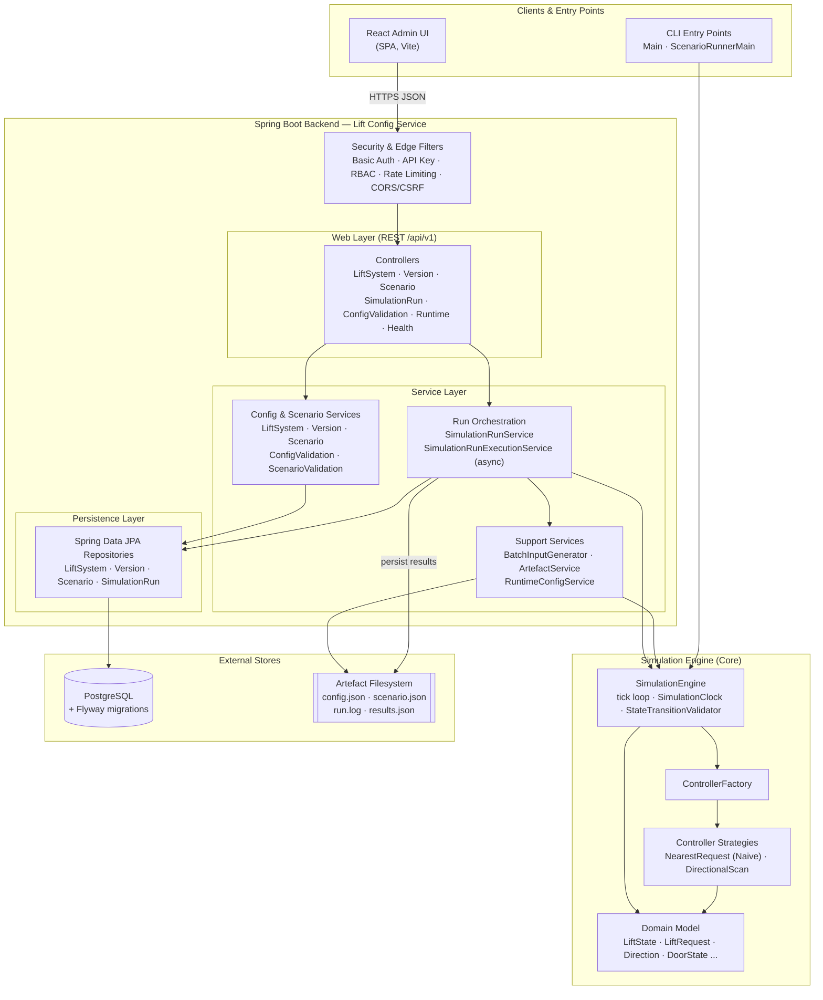
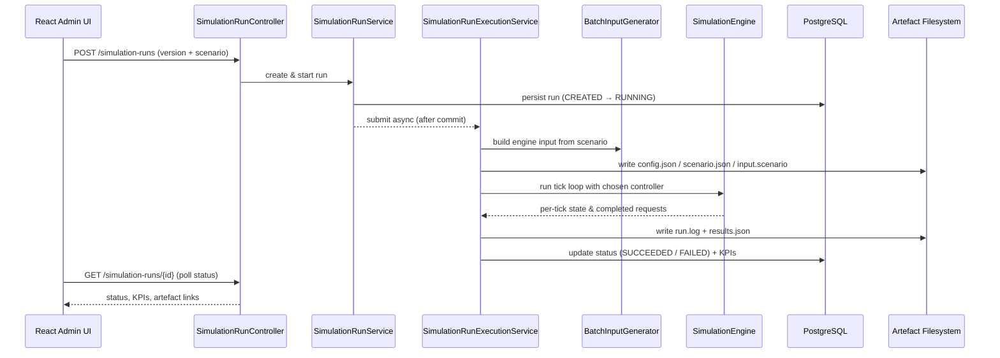

# Architecture Overview

This document gives a high-level, visual overview of the Lift Simulator's
components and the main flows between them. It is intended to help new
contributors orient themselves quickly and to keep the system's structure
maintainable as it grows.

For the reasoning behind individual design choices, see the
[Architecture Decision Records](decisions). For developer-facing engine and
persistence internals, see the [Developer Guide](DEVELOPER-GUIDE.md).

## System context

The Lift Simulator models and tests lift (elevator) controller algorithms. It
is delivered as a Spring Boot backend (the *Lift Config Service*) plus a React
single-page admin UI, backed by PostgreSQL. A standalone simulation engine sits
at the core and is reused both by the backend's asynchronous run executor and by
the command-line entry points.

> **Single lift system per run.** The persistence model can store many lift
> systems and versions, but each simulation run executes exactly one selected
> system/version/scenario combination. This keeps scheduling, artefact capture,
> and KPI calculation deterministic.

## High-level component diagram

The diagram below is also kept as a standalone source file at
[`architecture-diagram.mermaid`](architecture-diagram.mermaid). GitHub renders
Mermaid code blocks natively, so the diagram appears inline here.

## Components

### Clients & entry points

- **React Admin UI** (`frontend/`) — a Vite-built single-page application that
  provides the dashboard, lift-system and version management, scenario builder,
  simulator runs, configuration validator, and health check. It talks to the
  backend over REST and is packaged into the Spring Boot JAR (served from `/`)
  via the Maven `frontend` profile.
- **CLI entry points** (`com.liftsimulator.Main`,
  `scenario.ScenarioRunnerMain`) — lightweight command-line drivers that
  exercise the simulation engine directly without the web stack, used for demos
  and scripted scenario files.

### Spring Boot backend (Lift Config Service)

Built on Spring Boot 4.1 (Spring Framework 7, Spring Security 7.1, Hibernate
ORM 7, Jackson 3, Flyway 12); the full dependency baseline table lives in the
README's Development Setup section. Runs on Java 17+ (CI builds and tests on
Java 21 LTS).

- **Security & edge filters** (`admin.config`, `admin.security`) — HTTP Basic
  authentication for admin APIs, API-key authentication for runtime/simulation
  APIs, role-based access control (ADMIN / VIEWER), token-bucket rate limiting
  (Bucket4j), and explicit CORS/CSRF policy.
- **Web layer** (`admin.controller`, `runtime.controller`) — REST controllers
  under `/api/v1` for lift systems, versions, scenarios, simulation runs,
  configuration validation, runtime configuration, and health, plus SPA
  forwarding for client-side routes. Documented via OpenAPI/Swagger.
- **Service layer** (`admin.service`, `runtime.service`) — business logic:
  - *Config & scenario services* manage CRUD, the publish/archive workflow, and
    validation of configuration and scenario JSON.
  - *Run orchestration* — `SimulationRunService` manages run lifecycle state,
    while `SimulationRunExecutionService` runs simulations asynchronously on a
    thread pool, supports cancellation, and persists artefacts and KPIs.
  - *Support services* — `BatchInputGenerator` turns scenarios into engine
    input, `ArtefactService` reads/writes run artefacts, and
    `RuntimeConfigService` backs published-configuration reads for the lightweight runtime API.
- **Persistence layer** (`admin.repository`, `admin.entity`) — Spring Data JPA
  repositories and entities (`LiftSystem`, `LiftSystemVersion`, `Scenario`,
  `SimulationRun`) mapping to PostgreSQL, with versioned configurations stored as
  JSONB.

### Simulation engine (core)

- **`SimulationEngine`** (`com.liftsimulator.engine`) — the tick-based
  simulation loop, driven by a deterministic `SimulationClock` and guarded by a
  `StateTransitionValidator`.
- **`ControllerFactory` and controller strategies** — selectable scheduling
  algorithms: nearest-request routing (`NaiveLiftController`) and
  `DirectionalScanLiftController`, behind the `LiftController` interface.
- **Domain model** (`com.liftsimulator.domain`) — immutable, first-class types
  such as `LiftState`, `LiftRequest`, `Direction`, `DoorState`, and the
  request/lift state machines.

### External stores

- **PostgreSQL** — primary data store; schema is created and migrated by Flyway
  on startup.
- **Artefact filesystem** — per-run directory holding `config.json`,
  `scenario.json` / `input.scenario`, `run.log`, and `results.json` for
  reproduction and KPI review.

## Key flows

### Configuration management

A user manages lift systems, versions, and scenarios through the admin UI. Each
request passes through the security/edge filters, is handled by a controller,
delegated to the matching service for validation and the publish/archive
workflow, and persisted through a JPA repository to PostgreSQL.

### Simulation run

The sequence below shows how a launched run reaches the engine and produces
artefacts and KPIs.

### CLI run

The CLI entry points construct a controller via `ControllerFactory` and drive
`SimulationEngine` directly, printing per-tick state — bypassing the web,
service, and persistence layers entirely.

## Keeping this document current

When you add a major component, controller group, service, or external
dependency, update both this document and
[`architecture-diagram.mermaid`](architecture-diagram.mermaid) so the diagram
stays an accurate map of the system.
